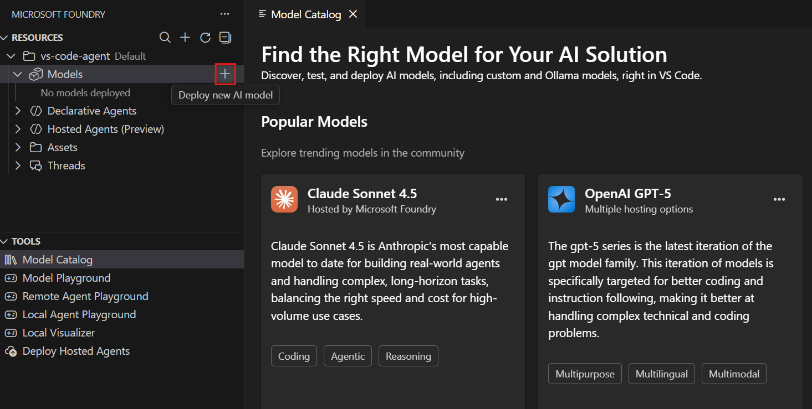
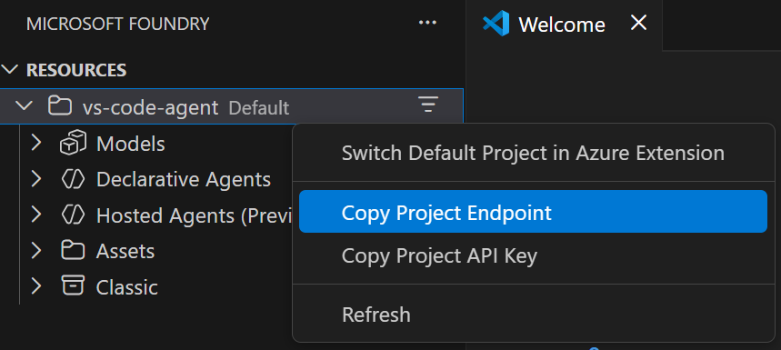

---
lab:
    title: 'Develop a multi-agent solution with Microsoft Agent Framework'
    description: 'Learn to configure multiple agents to collaborate using the Microsoft Agent Framework SDK'
    level: 300
    duration: 30
    islab: true
---

# Develop a multi-agent solution

In this exercise, you'll practice using the sequential orchestration pattern in the Microsoft Agent Framework SDK. You'll create a simple pipeline of three agents that work together to process customer feedback and suggest next steps. You'll create the following agents:

- The Summarizer agent will condense raw feedback into a short, neutral sentence.
- The Classifier agent will categorize the feedback as Positive, Negative, or a Feature request.
- Finally, the Recommended Action agent will recommend an appropriate follow-up step.

You'll learn how to use the Microsoft Agent Framework SDK to break down a problem, route it through the right agents, and produce actionable results. Let's get started!

This exercise should take approximately **30** minutes to complete.

> **Note**: Some of the technologies used in this exercise are in preview or in active development. You may experience some unexpected behavior, warnings, or errors.

## Prerequisites

Before starting this exercise, ensure you have:

- [Visual Studio Code](https://code.visualstudio.com/) installed on your local machine
- An active [Azure subscription](https://azure.microsoft.com/free/)
- [Python 3.13](https://www.python.org/downloads/) or later installed
- [Git](https://git-scm.com/downloads) installed on your local machine

## Install the Microsoft Foundry VS Code extension

Let's start by installing and setting up the VS Code extension.

1. Open Visual Studio Code.

1. Select **Extensions** from the left pane (or press **Ctrl+Shift+X**).

1. In the search bar, type **Microsoft Foundry** and press Enter.

1. Select the **Microsoft Foundry** extension from Microsoft and click **Install**.

1. After installation is complete, verify the extension appears in the primary navigation bar on the left side of Visual Studio Code.

## Sign in to Azure and create a project

Now you'll connect to your Azure resources and create a new Microsoft Foundry project.

1. In the VS Code sidebar, select the **Microsoft Foundry** extension icon.

1. In the Resources view, select **Sign in to Azure...** and follow the authentication prompts.

   > **Note**: You won't see this option if you're already signed in.

1. Create a new Foundry project by selecting the **+** (plus) icon next to **Resources** in the Foundry Extension view.

1. Select your Azure subscription from the dropdown.

1. Choose whether to create a new resource group or use an existing one:

   **To create a new resource group:**
   - Select **Create new resource group** and press Enter
   - Enter a name for your resource group (e.g., "rg-ai-agents-lab") and press Enter
   - Select a location from the available options and press Enter

   **To use an existing resource group:**
   - Select the resource group you want to use from the list and press Enter

1. Enter a name for your Foundry project (e.g., "ai-agents-project") in the textbox and press Enter.

1. Wait for the project deployment to complete. A popup will appear with the message "Project deployed successfully."

## Deploy a model

In this task, you'll deploy a model from the Model Catalog to use with your agent.

1. When the "Project deployed successfully" popup appears, select the **Deploy a model** button. This opens the Model Catalog.

   > **Tip**: You can also access the Model Catalog by selecting the **+** icon next to **Models** in the Resources section, or by pressing **F1** and running the command **Microsoft Foundry: Open Model Catalog**.

1. In the Model Catalog, locate the **gpt-4.1** model (you can use the search bar to find it quickly).

    

1. Select **Deploy** next to the gpt-4.1 model.

1. Configure the deployment settings:
   - **Deployment name**: Enter a name like "gpt-4.1"
   - **Deployment type**: Select **Global Standard** (or **Standard** if Global Standard is not available)
   - **Model version**: Leave as default
   - **Tokens per minute**: Leave as default

1. Select **Deploy in Microsoft Foundry** in the bottom-left corner.

1. In the confirmation dialog, select **Deploy** to deploy the model.

1. Wait for the deployment to complete. Your deployed model will appear under the **Models** section in the Resources view.

1. Right-click the name project deployment and select **Copy Project Endpoint**. You'll need this URL to connect your agent to the Foundry project in the next steps.

   

## Clone the starter code repository

For this exercise, you'll use starter code that will help you connect to your Foundry project and create a multi-agent solution that can process customer feedback. You'll clone this code from a GitHub repository.

1. Navigate to the **Welcome** tab in VS Code (you can open it by selecting **Help > Welcome** from the menu bar).

1. Select **Clone git repository** and enter the URL of the starter code repository: `https://github.com/MicrosoftLearning/mslearn-ai-agents.git`

1. Create a new folder and choose **Select as Repository Destination**, then open the cloned repository when prompted.

1. In the Explorer view, navigate to the **Labfiles/05-agent-orchestration/Python** folder to find the starter code for this exercise.

1. Right-click on the **requirements.txt** file and select **Open in Integrated Terminal**.

1. In the terminal, enter the following command to install the required Python packages in a virtual environment:

    ```
    python -m venv labenv
    .\labenv\Scripts\Activate.ps1
    pip install -r requirements.txt
    ```

1. Open the **.env** file, replace the **your_project_endpoint** placeholder with the endpoint for your project (copied from the project deployment resource in the Microsoft Foundry extension) and ensure that the MODEL_DEPLOYMENT_NAME variable is set to your model deployment name. Use **Ctrl+S** to save the file after making these changes.

## Create AI agents

Now you're ready to create the agents for your multi-agent solution! Let's get started!

1. Open the **agents.py** file in the code editor.

1. At the top of the file under the comment **Add references**, and add the following code to reference the namespaces in the libraries you'll need to implement your agent:

    ```python
   # Add references
   import asyncio
   from typing import cast
   from dotenv import load_dotenv
   from agent_framework import Message
   from agent_framework.azure import AzureAIAgentClient
   from agent_framework.orchestrations import SequentialBuilder
   from azure.identity import AzureCliCredential

   load_dotenv()
    ```

1. In the **main** function, take a moment to review the agent instructions. These instructions define the behavior of each agent in the orchestration.

1. Add the following code under the comment **Create the chat client**:

    ```python
   # Create the chat client
   credential = AzureCliCredential()
   async with (
       AzureAIAgentClient(credential=credential) as chat_client,
   ):
    ```

    Note that the **AzureCliCredential** object will allow your code to authenticate to your Azure account. The **AzureAIAgentClient** object will automatically include the Foundry project settings from the .env configuration.

1. Add the following code under the comment **Create agents**:

    (Be sure to maintain the indentation level)

    ```python
   # Create agents
   summarizer = chat_client.as_agent(
       instructions=summarizer_instructions,
       name="summarizer",
   )

   classifier = chat_client.as_agent(
       instructions=classifier_instructions,
       name="classifier",
   )

   action = chat_client.as_agent(
       instructions=action_instructions,
       name="action",
   )
    ```

## Create a sequential orchestration

1. In the **main** function, find the comment **Initialize the current feedback** and add the following code:

    (Be sure to maintain the indentation level)

    ```python
   # Initialize the current feedback
   feedback="""
   I use the dashboard every day to monitor metrics, and it works well overall. 
   But when I'm working late at night, the bright screen is really harsh on my eyes. 
   If you added a dark mode option, it would make the experience much more comfortable.
   """
    ```

1. Under the comment **Build a sequential orchestration**, add the following code to define a sequential orchestration with the agents you defined:

    ```python
   # Build sequential orchestration
   workflow = SequentialBuilder(participants=[summarizer, classifier, action]).build()
    ```

    The agents will process the feedback in the order they are added to the orchestration.

1. Add the following code under the comment **Run and collect outputs**:

    ```python
   # Run and collect outputs
   outputs: list[list[Message]] = []
   async for event in workflow.run(f"Customer feedback: {feedback}", stream=True):
       if event.type == "output":
           outputs.append(cast(list[Message], event.data))
    ```

    This code runs the orchestration and collects the output from each of the participating agents.

1. Add the following code under the comment **Display outputs**:

    ```python
   # Display outputs
   if outputs:
       for i, msg in enumerate(outputs[-1], start=1):
           name = msg.author_name or ("assistant" if msg.role == "assistant" else "user")
           print(f"{'-' * 60}\n{i:02d} [{name}]\n{msg.text}")
    ```

    This code formats and displays the messages from the workflow outputs you collected from the orchestration.

1. Use the **CTRL+S** command to save your changes to the code file.

## Run the app

Now you're ready to run your code and watch your AI agents collaborate.

1. In the integrated terminal, enter the following command to run the application:

    ```
   python agents.py
    ```

1. You should see some output similar to the following:

    ```output
    ------------------------------------------------------------
    01 [user]
    Customer feedback:
        I use the dashboard every day to monitor metrics, and it works well overall.
        But when I'm working late at night, the bright screen is really harsh on my eyes.
        If you added a dark mode option, it would make the experience much more comfortable.

    ------------------------------------------------------------
    02 [summarizer]
    User requests a dark mode for better nighttime usability.
    ------------------------------------------------------------
    03 [classifier]
    Feature request
    ------------------------------------------------------------
    04 [action]
    Log as enhancement request for product backlog.
    ```

1. Optionally, you can try running the code using different feedback inputs, such as:

    ```output
    I use the dashboard every day to monitor metrics, and it works well overall. But when I'm working late at night, the bright screen is really harsh on my eyes. If you added a dark mode option, it would make the experience much more comfortable.
    ```

    ```output
    I reached out to your customer support yesterday because I couldn't access my account. The representative responded almost immediately, was polite and professional, and fixed the issue within minutes. Honestly, it was one of the best support experiences I've ever had.
    ```

1. When you're finished, enter `deactivate` in the terminal to exit the Python virtual environment.

## Summary

In this exercise, you practiced sequential orchestration with the Microsoft Agent Framework SDK, combining multiple agents into a single, streamlined workflow. Great work!

## Clean up

If you've finished exploring Azure AI Agent Service, you should delete the resources you have created in this exercise to avoid incurring unnecessary Azure costs.

### Delete your model

1. In VS Code, refresh the **Azure Resources** view.

1. Expand the **Models** subsection.

1. Right-click on your deployed model and select **Delete**.

### Delete the resource group

1. Open the [Azure portal](https://portal.azure.com).

1. Navigate to the resource group containing your Microsoft Foundry resources.

1. Select **Delete resource group** and confirm the deletion.
